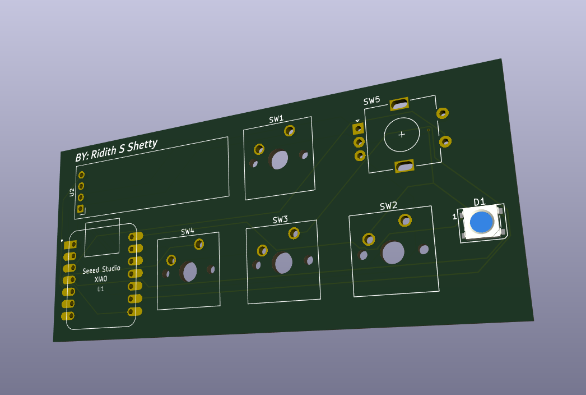
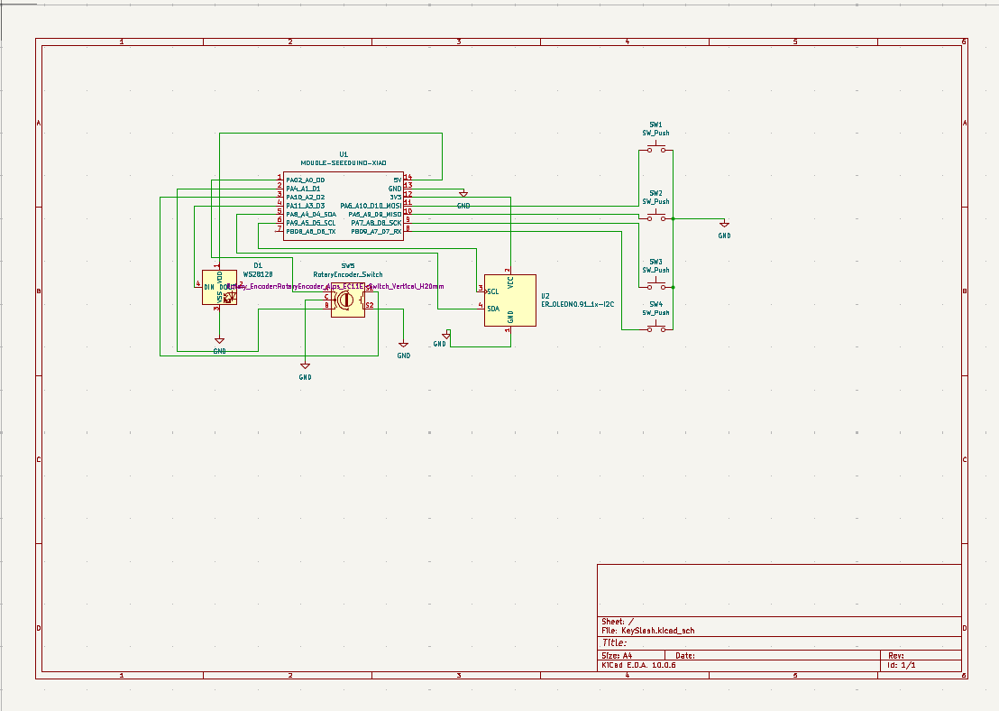
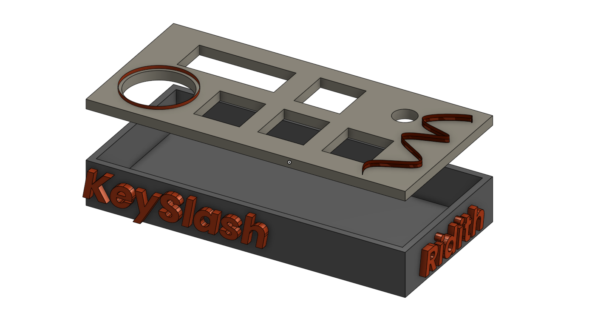

KeySlash Mini Keyboard
KeySlash is a wonderful mini keyboard made by me and designed by me, and this is the complete GitHub repo containing all of the folders that you need to duplicate it or recreate it. What this is, is essentially a four-key keyboard with one OLED screen and one clickable rotary encoder that gives you ultimate control right at your desk. The rotary encoder is especially cool because you can both rotate it smoothly and click it down for instant actions.

What Each Part Does
OLED Screen: Displays cool animations, custom text, and different graphics to spark creativity and give your setup a living, breathing feel.

Four Macro Buttons: Each switch holds a dedicated shortcut to speed up your workflow:

Button 1: Opens Codex directly so you can start coding instantly.
Button 2: Opens Claude for quick AI assistance.
Button 3: Opens Google Chrome to browse the web.
Button 4: Opens YouTube to kick back and enjoy.
Rotary Encoder: Twisting the encoder controls your system volume on the fly, while clicking it directly launches Spotify.

PCB
So this was my 2nd PCB design made by me and due to StarDance i was able to learn this wonderful skill. I dsigned the SCM the PCB which was increadibly fun yet frustrating when the wires clash!!

Functionality & 3D Enclosure
This is a heavily functionality-based mini keyboard designed to help you finish tasks faster while serving as an eye-catching centerpiece on your desk.

The 3D enclosure is a particularly special part of the build, featuring a unique color scheme of dark gray, light gray, and red. Each section has clean text and custom geometric styling, including a specialized clear window section designed to house a piece of acrylic that proudly showcases the Seeed Studio XIAO ESP32-S3 microcontroller board inside. It is a rewarding DIY project that brings both utility and personal style together.

